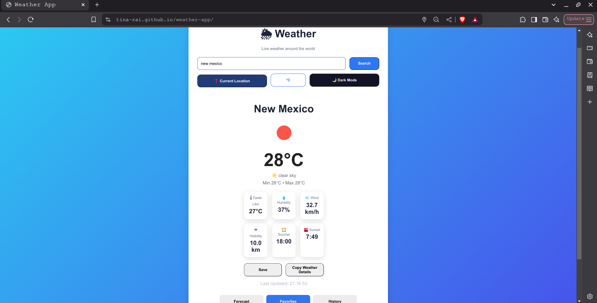
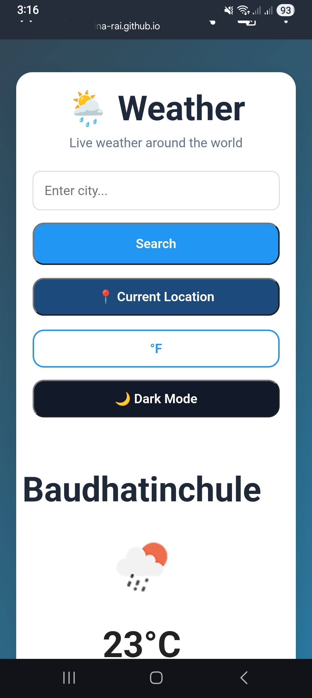

# 🌦️ Weather App

A modern weather application built with **HTML, CSS, and JavaScript** that provides real-time weather information and a 5-day forecast using the OpenWeatherMap API.

## Live Demo

https://tina-rai.github.io/weather-app/

##  Preview

### Light Mode


### Dark Mode


### Mobile View



---

##  Features

-   Search weather by city name
- 📍 Get weather using your current location
-   Real-time weather information
-   Current temperature
-   Feels Like temperature
-   Humidity
-   Wind Speed
-   Visibility
-   Sunrise & Sunset times
-   5-Day Weather Forecast
- 🌧️ Precipitation chance in forecast
- 🌙 Dark / Light Mode
-   Dynamic backgrounds based on weather conditions
- ⭐ Save favorite cities
-   Recent search history
-   Copy weather details to clipboard
-   Celsius / Fahrenheit conversion
-   Responsive UI design

---

## 🛠️ Built With

- HTML5
- CSS3
- JavaScript (ES6)
- OpenWeatherMap API
- Local Storage
- Geolocation API

---

## 📂 Project Structure

```
weather-app/
│
├── images/
│   ├── light-mode.png
│   ├── dark-mode.png
│   └── mobile-view.jpg
│
├── js/
│   ├── api.js
│   ├── app.js
│   ├── dom.js
│   ├── storage.js
│   ├── ui.js
│   └── utils.js
│
├── index.html
├── style.css
├── README.md
└── package.json
```

---

## 🚀 Getting Started

### Clone the repository

```bash
git clone https://github.com/tina-rai/weather-app.git
```

### Open the project

Simply open `index.html` in your browser.

Or run with VS Code Live Server.

---

## API

This project uses the OpenWeatherMap API.

1. Create a free account at https://openweathermap.org/
2. Generate an API key.
3. Open `js/api.js`.
4. Replace

```javascript
const API_KEY = "YOUR_API_KEY";
```

with your own API key.

##  What I Learned

Through this project I practiced:

- Working with REST APIs
- Fetch API
- Async / Await
- DOM Manipulation
- Event Handling
- Modular JavaScript architecture
- Local Storage
- Responsive UI Design
- CSS Grid & Flexbox
- Error Handling
- Git & GitHub workflow

---

##  Future Improvements

- Hourly forecast
- Air Quality Index (AQI)
- UV Index
- Weather maps
- Multiple language support

---

##  Author

**Tina Rai**

GitHub: https://github.com/tina-rai