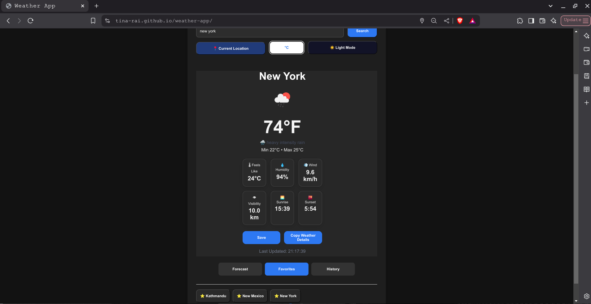

# 🌦️ Weather App

A modern weather application built with **HTML, CSS, and JavaScript** that provides real-time weather information and a 5-day forecast using the OpenWeatherMap API.

##  Preview

> Add screenshots here after uploading them.

### Light Mode


### Dark Mode


---

##  Features

-   Search weather by city name
- 📍 Get weather using your current location
-   Real-time weather information
-   Temperature display
-   Feels Like temperature
-   Humidity
-   Wind Speed
-   Visibility
-   Sunrise & Sunset times
-   5-Day Weather Forecast
- 🌧️ Precipitation chance in forecast
- 🌙 Dark / Light Mode
-   Dynamic backgrounds based on weather conditions
- ⭐ Save favorite cities
-   Recent search history
-   Copy weather details to clipboard
-   Celsius / Fahrenheit conversion
-   Fully responsive design

---

## 🛠️ Built With

- HTML5
- CSS3
- JavaScript (ES6)
- OpenWeatherMap API
- Local Storage
- Geolocation API

---

## 📂 Project Structure

```
weather-app/
│
├── images/
│
├── js/
│   ├── api.js
│   ├── app.js
│   ├── dom.js
│   ├── storage.js
│   ├── ui.js
│   └── utils.js
│
├── index.html
├── style.css
├── package.json
└── README.md
```

---

## 🚀 Getting Started

### Clone the repository

```bash
git clone https://github.com/tina-rai/weather-app.git
```

### Open the project

Simply open `index.html` in your browser.

Or run with VS Code Live Server.

---

##  API

This project uses the **OpenWeatherMap API**.

Create a free account and generate your own API key.

Replace

```javascript
const API_KEY = "YOUR_API_KEY";
```

with your own key.

---

##  What I Learned

Through this project I practiced:

- Working with REST APIs
- Fetch API
- Async / Await
- DOM Manipulation
- Event Handling
- Modular JavaScript
- Local Storage
- Responsive Web Design
- CSS Grid & Flexbox
- Error Handling
- Git & GitHub workflow

---

## 📈 Future Improvements

- Hourly forecast
- Air Quality Index (AQI)
- UV Index
- Weather maps
- Multiple language support

---

## 👩‍💻 Author

**Tina Rai**

GitHub: https://github.com/tina-rai